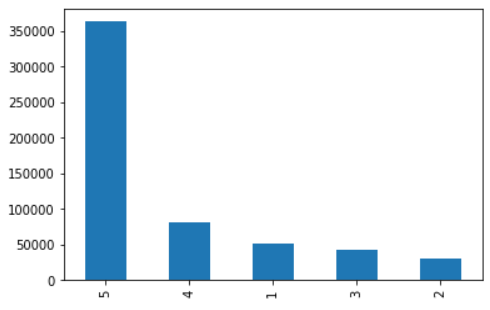
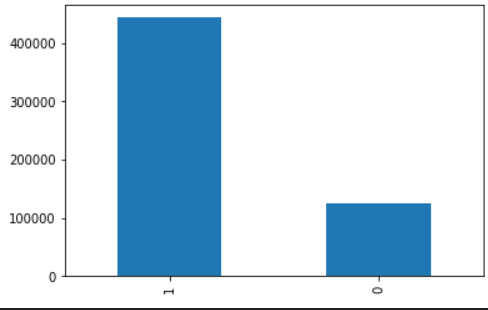
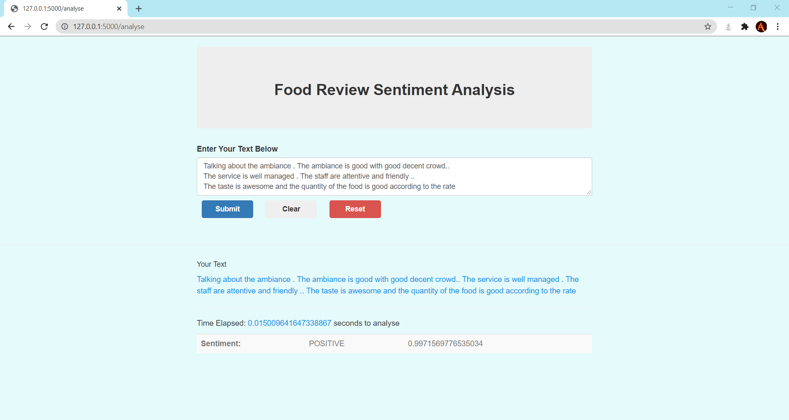
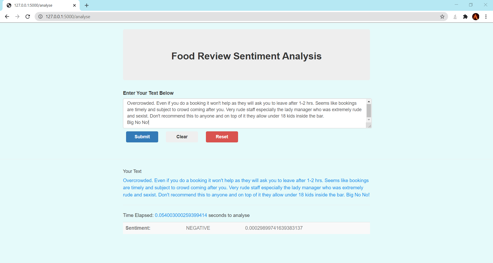

# NLP-Amazon-Fine-Food-Review-Analaysis

The following web application is used to predict the sentiment of the reviews provided by customers as Positive or Negative.

<h2>Index</h2> 

<ol>
  <li>Dataset</li>
  <li>Installation</li>
  <li>Working</li>
  <li>Resutls</li>
</ol>
<hr>
<br><br>
<h2> Dataset </h2>

  In this project, we are using dataset from kaggle . The link for the dataset is <a href="https://www.kaggle.com/snap/amazon-fine-food-reviews" > Amazon Fine Food Reviews </a><br><br>
  This dataset consists of reviews of fine foods from amazon. The data span a period of more than 10 years, including all ~500,000 reviews up to October 2012. Reviews include product and user information, ratings, and a plain text review. It also includes reviews from all other Amazon categories.
  
  </img>

<br><br>
<h2> Installation </h2>

Anaconda users:

```
  1. conda install -c anaconda numpy
  2. conda install -c anaconda pandas
  3. conda install -c conda-forge spacy
  4. conda install -c conda-forge scattertext
  5. conda install -c conda-forge sense2vec
  6. conda install -c anaconda flask
  7. conda install -c conda-forge flask-bootstrap
  8. conda install -c conda-forge textblob

```

Python users:

```
  1. pip install numpy
  2. pip install pandas
  3. pip install spacy
  4. pip install scattertext
  5. pip install sense2vec
  6. pip install Flask
  7. pip install Flask-Bootstrap
  8. pip install textblob
```


<br><br>
<h2> Description  </h2>
<hr>
<p>
In this we are going to tackle an interesting natural language processing problem i.e sentiment or text classification. We will explore texual data using amazing spaCy library   and build a text classification model.

We will extract linguistic features like  tokenization, part-of-speech tagging, dependency parsing,  lemmatization ,  named entities recognition,  Sentence Boundary Detection	for building language models later

Word vectors and similarity -> sense2vec 
Text classification model -> SpaCy TextCategorizer

<b>We will treat rating 4 and 5 as positive and rest as negative reviews.</b>

</img>

  <b>1. Tokenization </b><br>
  First step in any nlp pipeline is tokenizing text i.e breaking down paragraphs into sentenses and then sentenses into words, punctuations and so on. we will load english language model to tokenize our english text. Every language is different and have different rules. Spacy offers 8 different language models.
  <hr>

  <b>2. Part-of-speech tagging </b><br>
  After tokenization we can parse and tag variety of parts of speech to paragraph text. SpaCy uses statistical models in background to predict which tag will go for each word(s) based on the context.
  <hr>

  <b>3. Lemmatization </b><br>
  It is the process of extracting uninflected/base form of the word. Lemma can be like For eg. Adjectives: best, better → good Adverbs: worse, worst → badly Nouns: ducks, children → duck, child Verbs: standing,stood → stand
  <hr>
  
  <b>4. Named Entity Recognition (NER)</b><br>
      Named entity is real world object like Person, Organization etc
      
      PERSON	      People, including fictional.
      NORP	        Nationalities or religious or political groups.
      FAC	          Buildings, airports, highways, bridges, etc.
      ORG	          Companies, agencies, institutions, etc.
      GPE	          Countries, cities, states.
      LOC	          Non-GPE locations, mountain ranges, bodies of water.
      PRODUCT	      Objects, vehicles, foods, etc. (Not services.)
      EVENT	        Named hurricanes, battles, wars, sports events, etc.
      WORK_OF_ART	  Titles of books, songs, etc.
      LAW	Named     documents made into laws.
      LANGUAGE	    Any named language.
      DATE	        Absolute or relative dates or periods.
      TIME	        Times smaller than a day.
      PERCENT	      Percentage, including "%".
      MONEY	        Monetary values, including unit.
      QUANTITY	    Measurements, as of weight or distance.
      ORDINAL	      "first", "second", etc.
      CARDINAL	    Numerals that do not fall under another type
      
   <hr>
      
  <b>5. Sence2vec</b><br>
  The idea is get something better than word2vec model. Sense2Vec is super simple. If the problem is that duck as in waterfowl and duck as in crouch are different concepts, the straight-forward solution is to just have two entries, duckN and duckV. Trask et al (2015) published a nice set of experiments showing that the idea worked well.
  <hr>
</p>
<br><br>
<h2> Results </h2>
<hr>
<h4> Positive output prediction with score </h4>
<hr>
</img>
<hr>
<br><br>

<hr>
<h4> Negative output prediction with score </h4>
<hr>
</img>
<hr>
